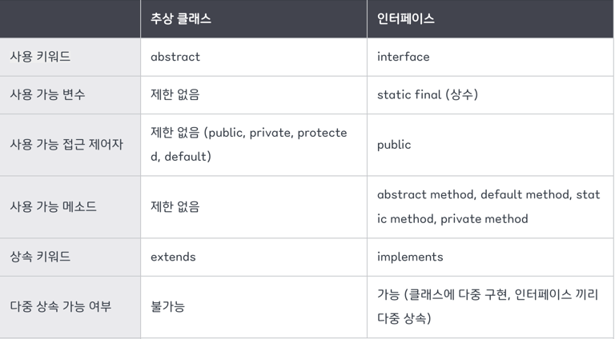
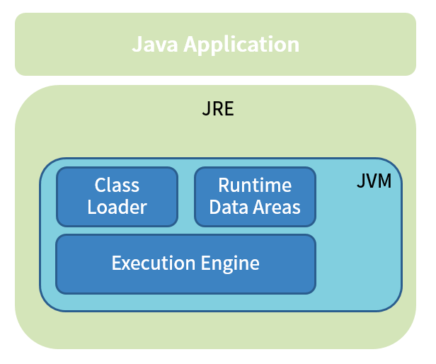
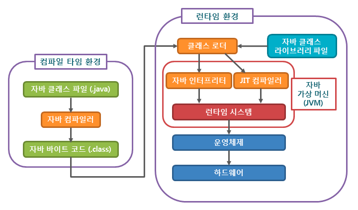
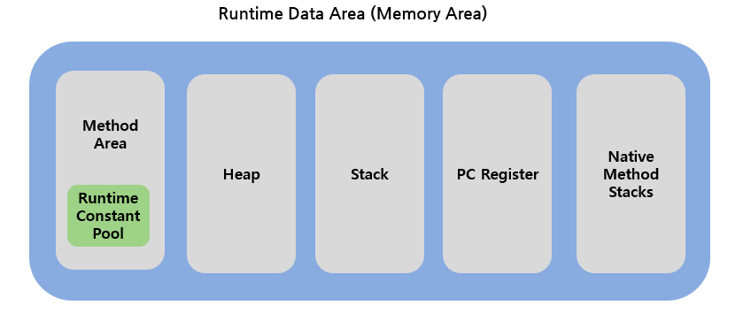

# 자바 핵심 개념 정리
<details>
<summary>Java에서 제공하는 원시 타입들에 무엇이 있고, 각각 몇 바이트를 차지하나요?</summary>
<div markdown="1">
    - int, long, double, float, boolean, byte, short, char을 Java에서 미리 정의하고 제공한다.
    <br>
    - int: 4byte
    <br>
    - long: 8byte
    <br>
    - double: 8byte
    <br>
    - float: 4byte
    <br>
    - boolean: 1byte
    <br>
    - byte: 1byte
    <br>
    - short: 2byte
    <br>
    - char: 2byte
    <br>
</div>
</details>
<br>

<details>
<summary>오버라이딩(OverRiding)과 오버로딩(OverLoading)에 대해 설명해주세요.</summary>
<div markdown="1">

1. 오버로딩
- 자바의 한 클래스 내에 이미 사용하려는 이름과 같은 이름을 가진 메소드가 있더라도 매개변수의 개수 또는 타입이 다르면, 같은 이름을 사용해서 메소드를 정의할 수 있다.
- 오버로딩을 사용하는 이유: 같은 기능을 하는 메소드를 하나의 이름으로 사용함으로써 메소드의 이름을 절약할 수 있음.
- 조건: 메소드의 이름이 같고 **매개변수의 개수나 타입이 달라야 함**. 리턴 값만 다른 것은 오버로딩 불가.
- 특징: 접근 제어자(private, public, ...)를 자유롭게 지정할 수 있지만, 접근 제어자만 다르다고 해서 오버로딩할 수는 없음. (=매개변수의 차이로만 구현 가능)
- 예시

    ```
    class Overloading {
        public static void main(String[] args) {
            OverloadingMethods om = new OverloadingMethods();
            
            om.print();
            System.out.println(om.print(3));
            om.print("hello java");
            System.out.println(om.print(4, 5));
        }
    }
    
    class OverloadingMethods {
        public void print() {
            System.out.println("overloading1");
        }
    
        String print(Integer a) {
            System.out.println("overloading2");
            return a.toString();
        }
    
        void print(String a) {
            System.out.println("overloading3");
            System.out.println(a);
        }
    
        String print(Integer a, Integer b) {
            System.out.println("overloading4");
            return a.toString() + b.toString();
        }
    }
    
    // result
    overloading1
    overloading2
    3
    overloading3
    Hello!
    overloading4
    45
    ```

2. 오버라이딩
- 부모 클래스로부터 상속받은 메소드를 자식 클래스에서 재정의하는 것.
- 오버라이딩을 사용하는 이유: 부모 클래스로부터 상속받은 메소드를 자식 클래스에서 상황에 맞게 변경해야하는 경우(당연함..)
- 조건: 오버라이딩하고자 하는 **메소드의 이름, 매개변수, 리턴 값이 모두 같아야 함**.

- 예시
    ```
    public class OverridingTest {

        public static void main(String[] args) {
            Person person = new Person();
            Child child = new Child();
            Senior senior = new Senior();
            
            person.cry();
            child.cry();
            senior.cry();
        }
    }
    
    class Person {
        void cry() {
        System.out.println("흑흑");
        }
    }
    
    class Child extends Person {
        @Override
        protected void cry() {
        System.out.println("엉엉");
        }
    }
    
    class Senior extends Person {
        @Override
        public void cry() {
        System.out.println("훌쩍훌쩍");
        }
    }
    
    // result
    흑흑
    엉엉
    훌쩍훌쩍
    ```
- 오버라이딩에서 접근 제어자를 설정하는 규칙
  - 자식 클래스에서 오버라이딩하는 메소드의 접근 제어자는 부모 클래스보다 더 좁게 설정할 수 없음.
  - 예외(Exception)는 부모 클래스의 메소드 보다 많이 선언할 수 없음.
  - static메소드를 인스턴스의 메소드로 또는 그 반대로 바꿀 수 없음.
3. 오버로딩 vs. 오버라이딩
- 오버로딩: 기존에 없는 새로운 메소드를 추가하는 것, 상속관계에서 적용.
- 오버라이딩: 상속받은 메서드를 재정의하는 것, 같은 클래스 내에서 적용.
</div>
</details>
<br>

<details>
<summary>객체지향 프로그래밍(OOP)에 대해 설명해주세요</summary>
<div markdown="1">

- 프로그래밍에서 필요한 데이터를 추상화시켜 상태와 행위를 가진 객체를 만들고 그 객체들 간의 유기적인 상호작용을 통해 로직을 구성하는 프로그래밍 방법
- 객체지향의 장점: 클래스 단위로 모듈화해서 개발하기 때문에

    - 코드 재사용이 용이
    - 유지보수가 쉬움
    - 대형 프로젝트에 적합
</div>
</details>
<br>

<details>
<summary>추상 클래스와 인터페이스에 대해 설명해주시고, 차이에 대해 설명해주세요.</summary>
<div markdown="1">

1. 추상클래스
- 추상 메서드를 선언하여 상속을 통해서 자손 클래스에서 완성하도록 유도하는 클래스.
- 상속을 위한 클래스이기 때문에 따로 객체를 생성할 수 없음.
- 선언 방식
  ```
  abstract class ClassName {
    ...
    public abstract void MethodName();
  }
  ```
2. 인터페이스
- 다른 클래스를 작성하는데 도움을 주는 목적으로 작성하는 클래스.
- 추상클래스와 다르게 다중상속(구현)이 가능함
- 선언 방식
  ```
    interface InterfaceName {
      public static final ConstantName = value;
      public abstract void MethodName();
  ```
3. 추상클래스 vs. 인터페이스
- 공통점: 추상매서드를 사용할 수 있음.
- 차이점
  
  - 사용 목적
    - 인터페이스: `implements`라는 키워드처럼 인터페이스에 정의된 메서드를 각 클래스의 목적에 맞게 기능을 구현하는 느낌
    - 추상클래스: `extends` 키워드를 사용하여 자신의 기능들을 하위 클래스로 확장시키는 느낌

</div>
</details>
<br>

<details>
<summary>가비지 컬렉션(gc)란 무엇일까요?</summary>
<div markdown="1">

1. 메모리 관리 기법 중의 하나로, 프로그램이 동적으로 할당했던 메모리 영역 중에서 필요없게 된 영역을 해제하는 기능. JVM의 가비지 컬렉터가 수행함. 이때 필요없게 된 메모리 영역을 가비지(garbage)라고 한다.
2. JVM의 Heap 영역이 설계될 때의 전제
  - 대부분의 객체는 금방 접근 불가능한 상태(Unreachable)가 된다.
  - 오래된 객체에서 새로운 객체로의 참조는 아주 적게 존재한다.

3. Minor GC / Major GC
  - 객체의 생존 기간에 따라 Young generation, Old generation으로 나눔
  - Young 영역(=Minor GC 또는 Full GC)
    - 새롭게 생성된 객체가 할당되는 영역
    - 대부분의 객체가 금방 Unreachable 상태가 되기 때문에 많은 객체가 Young 영역에 생성되었다가 사라짐
  - Old 영역(Major GC)
    - Young 영역에서 Reachable 상태를 유지하며 살아남은 객체가 복사되는 영역
    - Young 영역보다 크게 할당되며, 영역이 큰 만큼 가비지는 적게 발생함.
4. GC 동작 방식
  - Stop The World: 가비지 컬렉션을 실행하기 위해 JVM이 애플리케이션의 실행을 멈추는 작업
- Mark and Sweep
  - Mark: 사용되는 메모리와 사용되지 않는 메모리를 식별하는 작업
  - Sweep - Mark 단계에서 사용되지 않음으로 식별된 메모리를 해제하는 작업
<br>
<br>
    
  **즉, 모든 작업을 중단시키면, GC는 스택의 모든 변수 또는 Reachable 객체를 스캔하면서 각각이 어떤 객체를 참고하고 있는지를 탐색 ➡️ 사용되고 있는 메모리를 식별 ➡️ Mark가 되지 않은 객체들을 메모리에서 제거**
</div>
</details>
<br>

<details>
<summary>JVM의 동작 방식에 대해 설명해 주세요.</summary>
<div markdown="1">

1. JVM의 구성요소


- 클래스 로더
  - 특징: 계층 구조, 위임 모델, 가시성 제한, 언로드 불가, 이름공간
  - 클래스 로드 과정: 로드 ➡️ 검증 ➡️ 준비 ➡️ 분석 ➡️ 초기화
- 런타임 데이터 영역
  - JVM이 OS에서 실행되면서 할당받는 메모리 영
  - 세부 영역: PC 레지스터, JVM 스택, 네이티브 메서드 스택, 힙, 메서드 영역, 런타임 상수 풀
- 실행 엔진
  - 클래스 로더를 통해 데이터 영역에 배치된 바이트 코드를 명령어 단위로 읽어서 실행
  - 바이트 코드를 기계가 실행할 수 있는 형태로 변환하는 방식: 인터프리터, JIT 컴파일러 
2. 동작 원리


- 작성한 자바 소스(.java)를 자바 컴파일러를 통해 자바 바이트 코드(.class)로 컴파일
- 컴파일된 바이트코드를 JVM의 클래스 로더에게 전달
- 클래스 로더가 동적 로딩을 통해 필요한 클래스들을 로딩 및 링크하여 런타임 데이터 영역(Runtime Data area), 즉 JVM의 메모리에 올림
- 실행 엔진이 JVM 메모리에 올라온 바이트 코드들을 명령어 단위로 하나씩 가져와서 실행
</div>
</details>
<br>

<details>
<summary>불변 객체란 무엇이고, final은 무엇일까요? 사용하는 이유와 함께 설명해주세요.</summary>
<div markdown="1">

1. 불변객체
- 재할당은 가능하지만, 한번 할당하면 내부 데이터를 변경할 수 없는 객체
- 객체 전체가 불변인 것도 있고, 일부 속성만 불변인 것도 있음. 경우에 따라서는 내부에서 사용하는 속성이 변화해도 외부에서 그 객체의 상태가 변하지 않은 것처럼 보인다면 불변 객체로 보기도 함.
- ex. String, Integer, Boolean 등
2. final
- 불변객체를 만들 때, 필드에 `final`을 사용하고 `SETTER`를 구현하지 않는 것이 기본 원칙. 따라서, **불변객체를 만들기 위해 `final`를 꼭 사용해야 함!**
<br>
  ➡️ 불변객체의 필드가 모두 원시 타입일 경우에만 가능하고, 참조 타입일 경우엔 추가적인 작업이 필요
  - 원시 타입만 있을 때
  
    ```
    // 변경 전
    public class BaseObject {

      private int value; // 필드에 final 사용하지 않음
    
      public BaseObject(final int value) {
        this.value = value;
      }
    
      public void setValue(int newValue) {
    	this.value = newValue;
      } // setter를 통해 int형 value값을 변경할 수 있으므로 불변객체 아님 
    
    }

    // 변경 후
    public class BaseObject {

      private final int value; // 필드에 final 사용 ➡️ setter 구현 불가능해짐
    
      public BaseObject(final int value) {
        this.value = value;
      } 
    
    }
    ```
  - 참조 타입이 있을 때 : 대부분 final을 사용하고, Setter를 작성하지 않는 것으로는 불변객체가 될 수 없음. 불변객체의 참조 변수 또한 불변이어야 함

    ```
    public class Efub {
      private final Team team;
  
      public Efub(final Team team) {
        this.team = team;
      }
  
      public Efub getTeam() {
        return team;
      }
    }
  
    class Team {
      private int value;
  
      public Team(final int value) {
        this.value = value;
      }
  
      public void setValue(final int value) {
        this.value = value;
      }
  
      public int getValue() {
        return value;
      }
    }
    
    // 1) 참조 객체가 일반 객체인 경우: 참조변수를 불변객체로 만들기
    public class Animal {
    
      private final Age age;

      public Animal(final Age age) {
        this.age = age;
      }
    }

    class Age {

      private final int value;

      public Age(final int value) {
        this.value = value;
      }
    }
    
    // 2) Array일 경우: 생성자에서 배열을 받아 copy하고 getter를 clone
    public class ArrayObject {

      private final int[] array;

      public ArrayObject(final int[] array) {
        this.array = Arrays.copyOf(array,array.length); // 생성자에서 배열을 받아 copy
      }


      public int[] getArray() {
        return (array == null) ? null : array.clone(); // getter를 clone -> 배열을 참조하거나 그대로 반환할 경우, 배열 내부값을 변경시킬 수 있지만 clone하면 외부에서 값을 변경시킬 수 없음
      }
    }
    
    // 3) List인 경우: 생성시 생성자 인자를 그대로 참조하지 않고, 새로운 List를 만들어 값을 복사
    public static void main(String[] args) {
      List<Animal> animals = new ArrayList<>();
      animals.add(new Animal(new Age(1)));

      ListObject listObject = new ListObject(animals);

      for (Animal animal : listObject.getAnimals()) {
        System.out.print(animal.getAge().getValue());
      }
      System.out.println();
      // Output: 1

      animals.add(new Animal(new Age(2))); // List인 animals에는 추가되지만 listObject의 List에는 추가되지 않는다

      for (Animal animal : listObject.getAnimals()) {
        System.out.print(animal.getAge().getValue());
      }
      System.out.println();
      // Output: 1
    }
    
  ```

</div>
</details>
<br>

<details>
<summary>자바의 메모리 영역에 대해 설명해주세요.</summary>
<div markdown="1">

- 자바의 메모리 영역

  

- Method Area
  - JVM이 실행되면서 생기는 공간
  - Class 정보, 전역변수 정보, Static 변수 정보가 저장되는 공간
  - Runtime Constant Pool 에는 말 그대로 '상수' 정보가 저장되는 공간
  - 모든 스레드에서 정보가 공유됨
- Heap
  - new 연산자로 생성된 객체, Array와 같은 동적으로 생성된 데이터가 저장되는 공간
  - Heap에 저장된 데이터는 Garbage Collector 가 처리하지 않는한 소멸되지 않음
  - Reference Type 의 데이터가 저장되는 공간
  - 모든 스레드에서 정보가 공유됨
- Stack
  - 지역변수, 메소드의 매개변수와 같이 잠시 사용되고 필요가 없어지는 데이터가 저장되는 공간
  - Last In First Out, 나중에 들어온 데이터가 먼저 나감
  - 만약, 지역변수 이지만 Reference Type일 경우에는 Heap 에 저장된 데이터의 주소값을 Stack 에 저장해서 사용하게 됨
  - 스레드마다 하나씩 존재
- PC Register
  - 스레드가 생성되면서 생기는 공간
  - 스레드가 어느 명령어를 처리하고 있는지 그 주소를 등록한다.
  - JVM이 실행하고 있는 현재 위치를 저장하는 역할
- Native Method Stack
  - Java 가 아닌 다른 언어 (C, C++) 로 구성된 메소드를 실행이 필요할 때 사용되는 공간
</div>
</details>
<br>

<details>
<summary>new String()과 리터럴(" ")의 차이에 대해 설명해주세요.</summary>
<div markdown="1">

- **String 리터럴은 StringPool 에 상수 형식으로 저장되지만 new String() 은 새로은 String 객체를 생성하여 동작**함
- String 리터럴
  ```
    String literal = "HelloWorld";
  ```
  - Heap 내의 String Constant Pool 이라는 영역에 할당됨
  - 만약, 이미 같은 값을 가지고있는 리터럴이 ConstantPool에 존재할때, 새로운 객체를 생성하지 않고, 기존에 존재하는 리터럴을 사용
- String 객체
  - 다른 객체들처럼 Heap 메모리에 새로운 주소를 할당 받음 ➡️ 따라서, 모든 String 변수의 주소가 다르게 저장됨
</div>
</details>
<br>

<details>
<summary>⭐️ 추가 과제: 람다(lambda)에 대해 알아볼까요?</summary>
<div markdown="1">

1. 익명 함수(Anonymous functions)를 지칭

2. 장단점 
   - 장점
     - 코드의 간결성: 불필요한 반복문의 삭제가 가능하며 복잡한 식을 단순하게 표현할 수 있음 
     - 지연연산 수행: 불필요한 연산을 최소화
     - 병렬처리 가능: 멀티쓰레디를 활용하여 병렬처리 사용 
   - 단점
     - 람다식의 호출이 까다로움
     - 람다 stream 사용 시 단순 for문 혹은 while문 사용 시 성능이 떨어짐 
     - 불필요하게 너무 사용하게 되면 오히려 가독성을 떨어뜨릴 수 있음
3. 표현식
   - 매개변수 화살표(->)를 함수몸체로 이용
   - 함수몸체가 단일 실행문이면 괄호{}를 생략할 수 있음 
   - 함수몸체가 return문으로만 구성되어 있는 경우 괄호{}를 생략 할 수 없음
   - ex.
    ```
    () -> {} 
    () -> 1
    () -> { return 1; }
   
    (int x) -> x+1
    (x) -> x+1
    x -> x+1
    (int x) -> { return x+1; }
    x -> { return x+1; }
    
    (int x, int y) -> x+y
    (x, y) -> x+y
    (x, y) -> { return x+y; }
    
    (String lam) -> lam.length()
    lam -> lam.length()
    (Thread lamT) -> { lamT.start(); }
    lamT -> { lamT.start(); }
    ```
</div>
</details>
<br>

<details>
<summary>⭐️ 추가 과제: 스트림(stream)에 대해 알아볼까요?</summary>
<div markdown="1">

1. Stream이란, **`데이터 처리연산`을 지원하도록 `소스`에서 추출된 `연속된 요소`**
  - `데이터 처리 연산`: 함수형 프로그래밍에서 지원하는 연산과 데이터베이스의 SQL 질의형과 비슷한 연산을 처리할 수 있음
  - `소스`: 컬렉션, 배열, I/O 자원등의 소스로부터 데이터를 소비하고 정렬된 컬렉션으로 스트림을 생성하면 정렬이 그대로 유지됨
  - `연속된 요소`: 컬렉션 자료구조와 마찬가지로 스트림은 특정 요소 형식으로 이루어진 연속된 값 집합의 인터페이스를 제공함
2. 등장 배경
  - 기존 루프문 처리의 문제점: 기존 Java에서 컬렉션 데이터를 처리할 때는 for, foreach 루프문을 사용하면서 컬렉션 내의 요소들을 하나씩 다루었음. 간단한 처리나 컬렉션의 크기가 작으면 큰 문제가 아니지만 복잡한 처리가 필요하거나 컬렉션의 크기가 커지면 루프문의 사용은 성능저하로 이어짐.
  - 스트림의 등장: JAVA8부터 컬렉션 데이터를 선언형으로 쉽게 처리할 수 있도록 함. 복잡한 루프문이 필요없어졌고, 병렬처리를 별도의 멀티쓰레드 구현 없이도 쉽게 구현할 수 있게 됨.
3. 특징
   - 파이프라이닝: 스트림 연산들은 서로 연결하여 큰 파이프 라인을 구성할수 있도록 스트림 자신을 반환함
   - 내부 반복: 반복자를 이용하여 명시적으로 반복하는 컬렉션과 다르게 스트림은 내부 반복 기능을 제공함
4. 사용 예시
  ```
  // 스트림 사용 X
  // 빨간색 사과 필터링
  List<Apple> redApples = forEach(appleList, (Apple apple) -> apple.getColor().equals("RED"));

  // 무게 순서대로 정렬
  redApples.sort(Comparator.comparing(Apple::getWeight));

  // 사과 고유번호 출력
  List<Integer> redHeavyAppleUid = new ArrayList<>();
  for (Apple apple : redApples)
    redHeavyAppleUid.add(apple.getUidNum());
    
    
  // 스트림 사용 O -> 단 한 줄로 표현할 수 있게 됨.
  List<Integer> redHeavyAppleUid = appleList.stream()
        .filter(apple -> apple.getColor().equals("RED"))        // 빨간색 사과 필터링
        .sorted(Comparator.comparing(Apple::getWeight))         // 무게 순서대로 정렬
        .map(Apple::getUidNum).collect(Collectors.toList());    // 사과 고유번호 출력 
  ```
</div>
</details>
<br>

